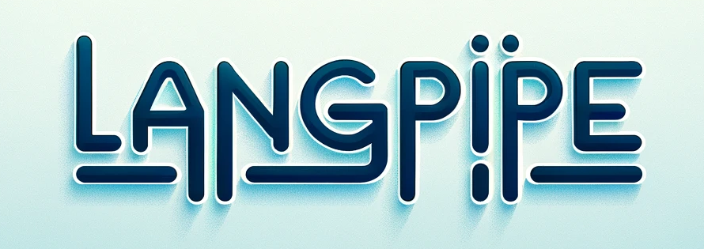

# LangPipe

**Human-friendly** bag of utilities for llms.

 logo generated by gpt-4 with dalle-3.

## Frequently Asked Questions

> What are the differences between Langchain and Langpipe?

1. Langpipe is more developer-friendly. Its api design follows best-practice  librarys like `transformers` and `torch`.

2. Langpipe is more control-friendly. It includes both high-level functionalities and low-level implmentation details.

3. Langpipe is designed to be less invasive, which means you control the usage of Langpipe, not vice.